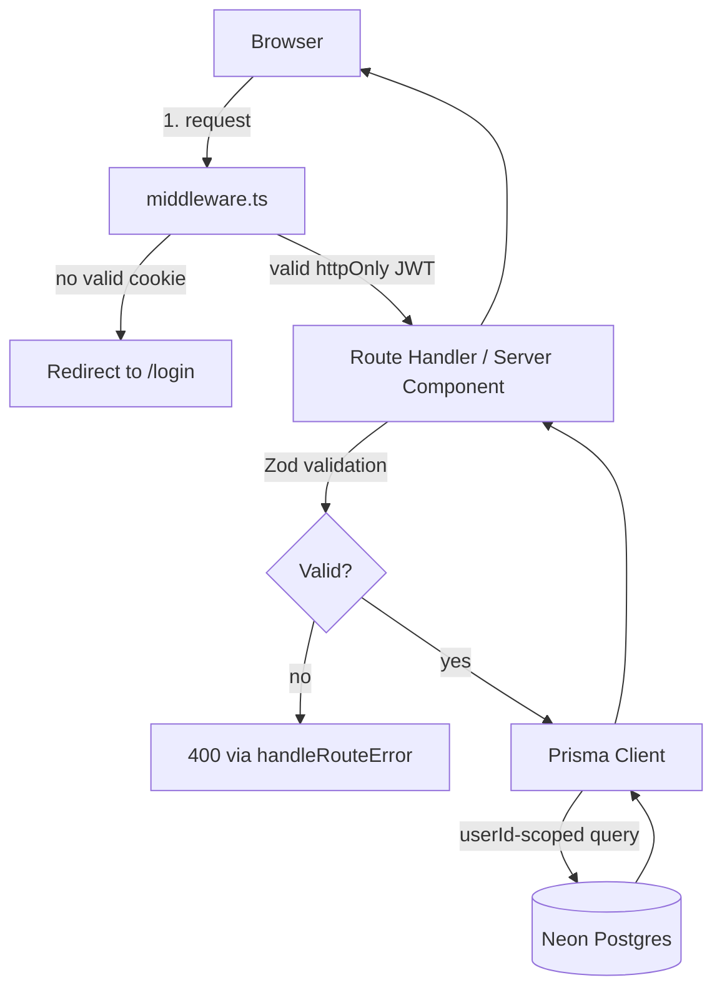
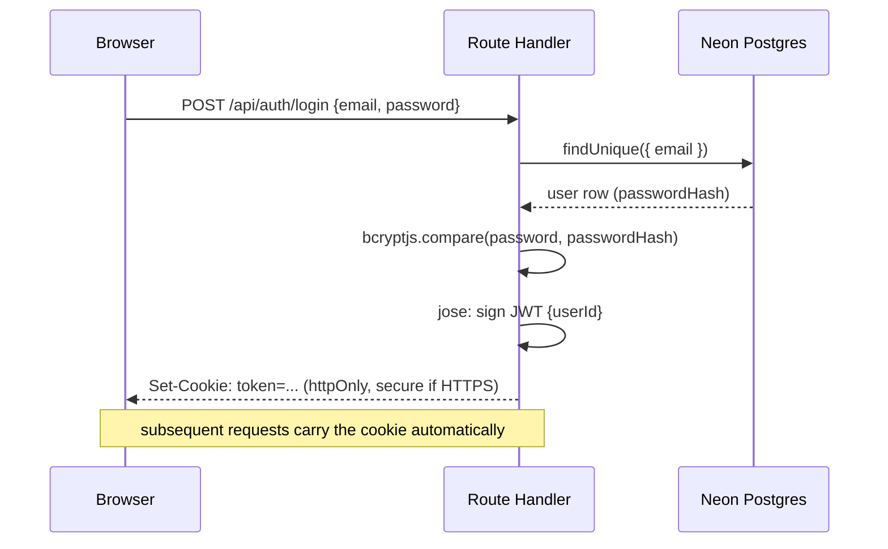
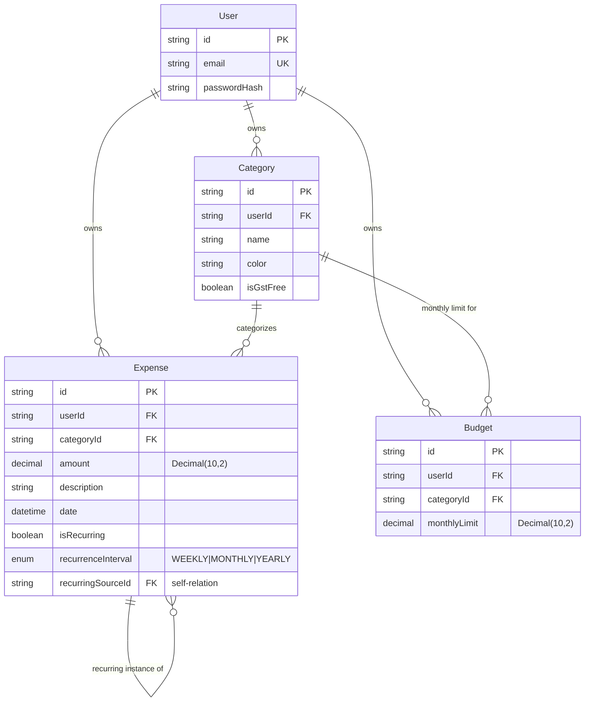
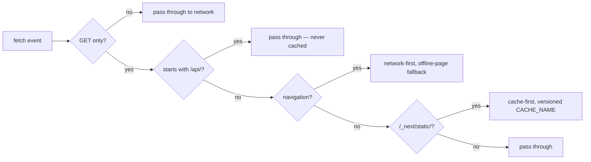

# Architecture

Budget Buddy is a full-stack personal expense tracker built with the
Next.js 14 App Router. This document is the map: how a request flows
through the system, how the data is shaped, and — in the decisions log
below — *why* it's built this way, not just what's here.

## Request flow

Every protected page (`/dashboard`, `/expenses`, `/budgets`) is gated by
`middleware.ts`, which verifies the `token` cookie before the request
reaches the page at all. Every mutation in every API route additionally
scopes its Prisma query by the authenticated `userId` (e.g.
`updateMany({ where: { id, userId } })`, checking the affected row count
before returning success) — the middleware keeps logged-out users out,
this second check keeps logged-in users from touching each other's data
(IDOR protection), and it holds even if the middleware config is ever
misconfigured for a route.

## Auth

No session table — the JWT itself is the session, verified statelessly
on every request by `middleware.ts` and by each route handler that needs
`getCurrentUser()`.

## Data model

Recurring expenses aren't generated by a cron job — there isn't one.
Each `Expense` row with `isRecurring: true` is a *template*; on
dashboard/expenses load, the app computes which occurrences should
exist between the template's date and today and inserts any missing
ones (`recurringSourceId` points back at the template), correctly
recovering month-end dates (e.g. a 31st-of-the-month template lands on
the 31st again once a month is long enough, rather than drifting to the
28th forever). See ADR-004.

## PWA / offline

The one rule that matters here: nothing under `/api/` is ever
cacheable. A finance app that showed a stale cached balance after a
network blip would be actively misleading, so every data read always
hits the network. Only static, content-hashed build assets and the
offline fallback page are cached. See ADR-005.

## Key architectural decisions

Short ADRs — context, decision, trade-off — for the choices that
would otherwise only live in git history.

### ADR-001: httpOnly JWT cookie auth instead of NextAuth
**Context:** Needed authentication with no paid infrastructure.
**Decision:** Hand-rolled auth — `jose` for JWT (Edge-runtime
compatible, unlike `jsonwebtoken`), `bcryptjs` for hashing (pure JS, no
native binding to break on Vercel's serverless build), token stored in
an `httpOnly` cookie, `secure` flag driven by the actual
`x-forwarded-proto` request header rather than `NODE_ENV` (so it's
correct in both `next dev` over HTTP and real HTTPS on Vercel).
**Trade-off:** More code to own than an auth library, but a much
smaller dependency surface and a genuine understanding of what "logged
in" means at the HTTP level — deliberate, since this project is a
learning vehicle as much as a shipped app.

### ADR-002: Decimal, not Float, for money
**Context:** Floating-point arithmetic doesn't represent money exactly
(`0.1 + 0.2 !== 0.3` in IEEE 754) — a classic source of cent-level
drift in financial software.
**Decision:** Every money column is Prisma `Decimal(10, 2)`, not
`Float`.
**Trade-off:** Slightly more ceremony converting to/from JS numbers at
the boundary; correctness that matters immediately, not just at scale.

### ADR-003: Neon Postgres + Prisma over a paid managed DB
**Context:** Needed relational data with real relations (recurring
expenses reference their own template) on a $0 budget.
**Decision:** Neon's serverless Postgres free tier, accessed through
Prisma for type-safe queries and migrations.
**Trade-off:** Neon's free tier cold-starts after idling, which shows
up as latency on the first request after a quiet period — CI's e2e
suite has explicit timeout headroom on the signup→dashboard assertion
for exactly this reason.

### ADR-004: Lazy-generated recurring expenses, not a cron job
**Context:** "Repeat this expense monthly" needs *something* to create
each new occurrence.
**Decision:** No scheduler. Missing occurrences are computed and
inserted the moment a user next loads their dashboard or expenses
page.
**Trade-off:** An occurrence technically doesn't exist in the database
until someone looks — irrelevant for a personal single-user tracker,
and it means zero extra infrastructure, zero cost, and zero moving
parts to keep running.

### ADR-005: Hand-rolled service worker over a PWA framework plugin
**Context:** Wanted real installability and offline resilience without
adding a heavy build-time PWA toolchain.
**Decision:** A single ~60-line `public/sw.js`, explicit about exactly
three behaviors (bypass `/api/`, network-first navigations with an
offline fallback, cache-first static assets) rather than a
framework-generated worker whose caching rules are implicit.
**Trade-off:** Manually written and manually correct — which is also
why three real caching-lifecycle bugs (permanently caching error
responses, a write not tied to `event.waitUntil`, cache reads not
scoped to the versioned cache name) were things this project actually
found and fixed, rather than inheriting a plugin's behavior unread.

### ADR-006: CI runs a production build, not `next dev`
**Context:** The e2e suite passed locally against `next dev` but
intermittently failed in CI.
**Decision:** CI's Playwright `webServer` runs `next build && next
start` — the same artifact that actually ships — not the dev server.
**Trade-off:** Slower CI runs (a full build first); catches an entire
class of dev-server-only behavior (like cold-compile latency) that a
green `next dev` run would hide until production.

## Deployment

Vercel, connected directly to this GitHub repo — every push to `main`
triggers a new build. One non-obvious requirement: `package.json` needs
`"postinstall": "prisma generate"`, because Next.js's build-time route
analysis loads every API route module (which touches Prisma Client),
and without that script Vercel's build environment never generates a
client for itself, only reusing whatever was last generated locally —
a real deploy failure this project hit and fixed.
