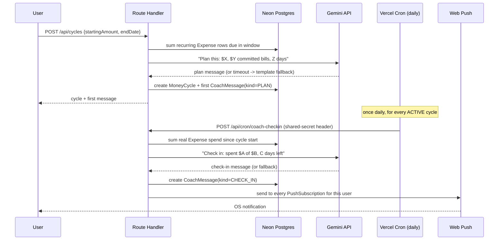

# Money Cycle + AI Coach — Design Spec

**Status:** Approved
**Spec 2 of 2** (Spec 1 — Neon Glass redesign — is complete, merged, and pushed; this feature ships natively in that design system)

## Summary

A "survive-till-payday" planning and coaching feature. A user starts a
**Money Cycle** by telling the app how much money they have and when
their next payday is. The app pulls in their real recurring bills due
in that window, computes a daily safe-to-spend allowance, and an AI
coach ("real AI-generated text," not templates — Google's Gemini API,
chosen specifically for its persistent free tier, unlike OpenAI's or
Anthropic's trial-credit-only access) presents that plan
conversationally. From then on, once a day, the coach compares real
tracked spending against the plan and pushes a fresh check-in as an
actual OS-level notification (Web Push), the same way Apple Health
nudges you — closing the loop the user asked for in their own words:
*"how should I stretch my money, how do I survive, how much should I
save."*

If the AI call ever fails, a plain computed-numbers message still gets
sent — the feature never goes silent, only the conversational polish
degrades.

## Architecture



Nothing here touches Spec 1's shipped surfaces (auth, expenses,
budgets, CSV import/export) — this is a new, additive subsystem. The
only shared logic is the recurring-expense computation, reused as-is
from `lib/generateDueRecurringExpenses.ts`, not duplicated.

## Data model

Three new models, all additive, all `onDelete: Cascade` from `User`
(matching every existing model's pattern):

```prisma
enum CycleStatus {
  ACTIVE
  COMPLETED
}

enum MessageKind {
  PLAN
  CHECK_IN
}

model MoneyCycle {
  id             String         @id @default(cuid())
  userId         String
  user           User           @relation(fields: [userId], references: [id], onDelete: Cascade)
  startingAmount Decimal        @db.Decimal(10, 2)
  startDate      DateTime
  endDate        DateTime
  status         CycleStatus    @default(ACTIVE)
  createdAt      DateTime       @default(now())
  messages       CoachMessage[]
}

model CoachMessage {
  id        String      @id @default(cuid())
  cycleId   String
  cycle     MoneyCycle  @relation(fields: [cycleId], references: [id], onDelete: Cascade)
  kind      MessageKind
  content   String
  createdAt DateTime    @default(now())
}

model PushSubscription {
  id        String   @id @default(cuid())
  userId    String
  user      User     @relation(fields: [userId], references: [id], onDelete: Cascade)
  endpoint  String   @unique
  p256dh    String
  auth      String
  createdAt DateTime @default(now())
}
```

`MoneyCycle.status` moves to `COMPLETED` when `endDate` passes (checked
lazily on load, same lazy-computation philosophy as recurring
expenses — no second cron job needed just for this). A user can only
have one `ACTIVE` cycle at a time; starting a new one while one is
active is rejected with a clear error telling them to wait or their
current cycle will simply complete on its own at `endDate`.

## New API routes

- `POST /api/cycles` — start a cycle. Zod-validated
  `{ startingAmount: number, endDate: string }`. Computes committed
  recurring spend in-window, calls the AI planner, creates the cycle
  and its first `CoachMessage`.
- `GET /api/cycles/active` — the current user's active cycle (if any)
  plus its full `CoachMessage` history, for the dashboard's Coach card.
- `POST /api/push/subscribe` — saves a `PushSubscription` (called from
  the client once the browser grants notification permission).
- `POST /api/push/unsubscribe` — removes it (called on permission
  revocation or logout, best-effort).
- `POST /api/cron/coach-checkin` — the daily cron target. Protected by
  a shared secret compared against a header Vercel Cron sends
  (`CRON_SECRET` env var) — not a public endpoint.

Every route follows the project's existing IDOR-safe pattern: every
query scoped to `userId`, verified via `getCurrentUser()`.

## The AI layer

`lib/ai/coach.ts` exports two pure-ish functions:
`generatePlanMessage(input): Promise<string>` and
`generateCheckInMessage(input): Promise<string>`, each wrapping a
Gemini API call with a hard timeout (5s) and a try/catch. On any
failure — timeout, rate limit (Gemini's free tier is generous but not
unlimited), malformed response — both fall back to a plain
computed-numbers template string built from the same input the AI
would have used, so the fallback is never missing information, only
missing personality. This mirrors the project's existing pattern of
extracting pure computational logic (`computeGstPaid`,
`aggregateByMonth`) separately from I/O-touching wrappers.

**New environment variables:** `GEMINI_API_KEY` (server-only, never
exposed to the client), `VAPID_PUBLIC_KEY` (exposed to the client,
safe by design — it's how the browser verifies push messages came from
this server), `VAPID_PRIVATE_KEY` (server-only), `CRON_SECRET`
(server-only, shared with Vercel's cron configuration).

## The push layer

`public/sw.js` gains a `push` event listener (its first — today it
only handles `install`/`activate`/`fetch`) that shows a notification
from the payload, and a `notificationclick` listener that focuses or
opens the app to `/dashboard`. A new client component,
`components/pwa/PushSubscribe.tsx`, requests notification permission
(only when the user explicitly opts in via a button on the Coach card —
never auto-prompted on page load, which browsers penalize and users
resent) and posts the resulting subscription to
`/api/push/subscribe`.

Sending uses the `web-push` npm package (the one new dependency this
spec adds) server-side with the VAPID key pair. A `410 Gone` response
from a push send means that subscription is dead (browser
uninstalled, permission revoked, etc.) — the cron job deletes that
`PushSubscription` row on a 410, rather than retrying or erroring the
whole batch for one stale subscription.

## UI (Neon Glass, native — no separate reskin needed)

A new "Coach" card on `/dashboard`, using the already-shipped `Card`
component (glass, glow, `backdrop-blur-xl`):

- **No active cycle:** a glass-panel form — "How much do you have, and
  until when?" — two fields (amount, end date via the existing
  `DateField` component), one submit button.
- **Active cycle:** three real numbers in gradient text (matching
  `CountUpStat`'s treatment) — amount remaining, days remaining, daily
  safe-to-spend — above a chat-style feed of past `CoachMessage`s
  (`PLAN` and `CHECK_IN` rendered as distinct, subtly different bubble
  styles), newest first. A "Notify me" button appears once per browser
  until permission is granted or explicitly dismissed.

Every new element uses only the existing design tokens and components
from Spec 1 — no new colors, no new fonts, no new animation patterns
beyond what's already shipped and already passing the accessibility
suite.

## Testing

- **Pure functions** (safe-to-spend math, pacing/day-count
  calculations, template-fallback string building): real unit tests,
  same TDD pattern as the rest of the codebase.
- **AI wrapper** (`lib/ai/coach.ts`): Gemini's client is mocked in
  Vitest (same mocking pattern already used for Prisma); tests assert
  both the happy path (mock returns text) and the fallback path (mock
  throws/times out, template message is used instead).
- **Push wrapper**: `web-push` is mocked; tests assert a 410 response
  triggers subscription deletion and does not throw for the rest of
  the batch.
- **New UI**: added to the existing axe-core WCAG 2.1 AA Playwright
  suite — the dashboard's Coach card, in both its empty and active
  states, must pass the same permanent accessibility gate every other
  page does.
- **Not covered by automated tests** (same honest carve-out this
  project made for the PWA phase in Spec 1's predecessor work): whether
  a real push notification visually arrives on a real OS is a manual/
  DevTools verification step, not something Vitest or Playwright can
  assert — documented as such in the implementation plan rather than
  faked with a test that doesn't actually prove it.

## Error handling summary

| Failure | Behavior |
|---|---|
| Gemini API times out / errors / rate-limits | Template fallback message used instead; cycle/check-in still created and (if applicable) still pushed |
| User denies notification permission | Cycle and in-app coach feed work exactly the same; just no OS push. In-app feed is always the source of truth |
| Push send returns 410 Gone | That `PushSubscription` row deleted; other subscriptions/users in the same cron run unaffected |
| Cron endpoint hit without the correct secret | 401, no data touched |
| User tries to start a second cycle while one is active | 400 with a clear message; existing cycle is untouched |

## Rollout

Directly to `main`, no feature flag — consistent with every prior
phase of this project. `GEMINI_API_KEY` is already in the local `.env`
(gitignored, confirmed) as of this spec being written; it and the
three other new env vars will need adding to Vercel's dashboard before
this feature works in production, called out explicitly as an
implementation-plan task rather than assumed.
